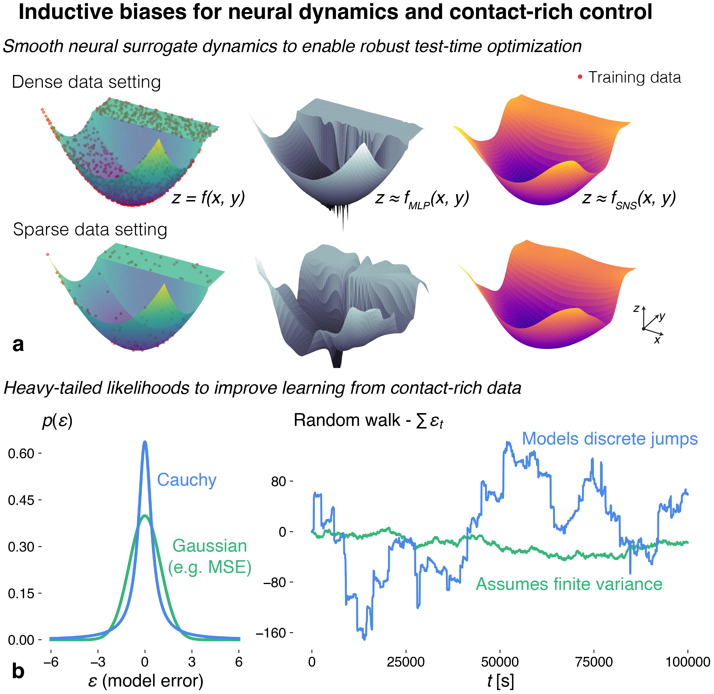
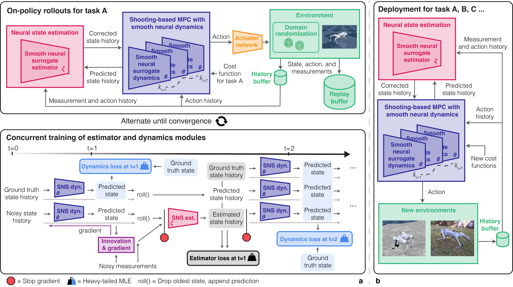

# Learning Legged MPC with Smooth Neural Surrogates
<a href="https://samavmoore.github.io/">Sam Moore</a>, <a href="https://easoplee.github.io/">Easop Lee</a>, and <a href="http://boyuanchen.com/">Boyuan Chen</a> <br>
_Duke University_ <br>

<span style="font-size:17px; display: block; text-align: left;">
    <a href=https://generalroboticslab.com/SNS-MPC target="_blank" style="text-decoration: underline;">[Project Page]</a> 
    <a href=https://youtu.be/ViwE7hVG-J4?si=Nq25zR65D3Kooub8 target="_blank" style="text-decoration: underline;">[Video]</a>
    <a href=https://arxiv.org/abs/2601.12169 target="_blank" style="text-decoration: underline;">[arXiv]</a> <br>
</span>

<p align="center">
     <br>
</p>

### Overview
Deep learning and model predictive control (MPC) can play complementary roles in legged robotics. However, integrating learned models with online planning remains challenging. When dynamics are learned with neural networks, three key difficulties arise: (1) stiff transitions from contact events may be inherited from the data; (2) additional non-physical local nonsmoothness can occur; and (3) training datasets can induce non-Gaussian model errors due to rapid state changes. We address (1) and (2) by introducing the smooth neural surrogate (SNS-MLP), a neural network with tunable smoothness designed to provide informative predictions and derivatives for trajectory optimization through contact. To address (3), we train these models using a heavy-tailed likelihood that better matches the empirical error distributions observed in legged-robot dynamics. Together, these design choices substantially improve the reliability, scalability, and generalizability of learned legged MPC. Across zero-shot locomotion tasks of increasing difficulty, smooth neural surrogates with robust learning yield consistent reductions in cumulative cost on simple, well-conditioned behaviors (typically 10-50%), while providing substantially larger gains in regimes where standard neural dynamics often fail outright. In these regimes, smoothing enables reliable execution (from 0/5 to 5/5 success) and produces 2-50x lower cumulative cost, reflecting orders-of-magnitude absolute improvements in robustness rather than incremental performance gains.

<p align="center">
     <br>
</p>

## Content
Coming soon!


## BibTeX

If you find this repo useful, please consider citing,
```
@misc{moore2026learningleggedmpc,
      title={Learning Legged MPC with Smooth Neural Surrogates}, 
      author={Samuel A. Moore and Easop Lee and Boyuan Chen},
      year={2026},
      eprint={2601.12169},
      archivePrefix={arXiv},
      primaryClass={cs.RO},
      url={https://arxiv.org/abs/2601.12169}, 
}
```

## Acknowledgements
`This work is supported by the National Science Foundation Graduate Research Fellowship, by ARO under award W911NF2410405, and by DARPA TIAMAT program under award HR00112490419.`.